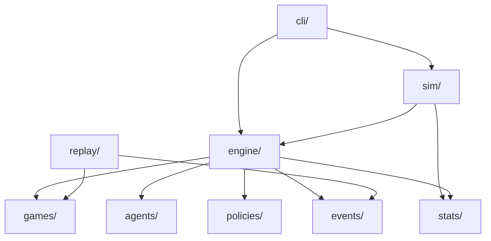
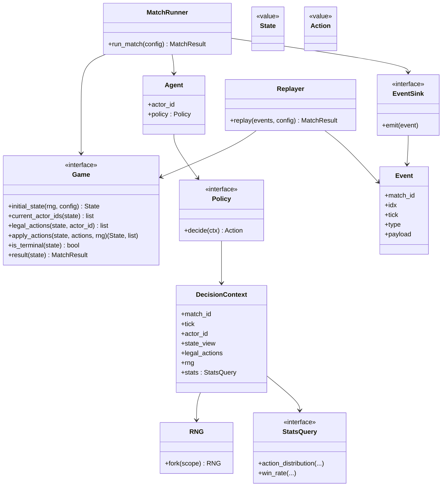
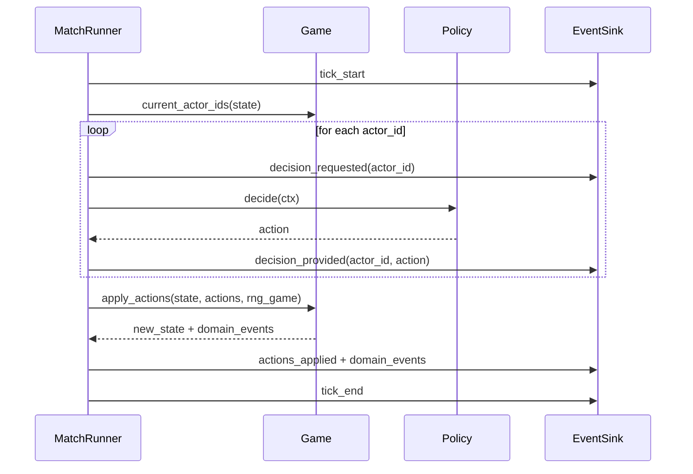

# bg_ai — Architecture

**Scope:** This document is the technical blueprint that implements `docs/PROJECT_BRIEF.md`, `docs/FEATURES.md`, and ADR 0001.
**Key constraints:** deterministic RNG, event-first trace, replay without policies, supports many game types, stats/query layer later.

---

## 1) Architecture summary

`bg_ai` is a deterministic simulation framework for running **matches** of a **game ruleset** using **agents** driven by **policies**, while emitting a complete **event trace** that can be exported and replayed later **without calling policies**.

Core pattern:

* **MatchRunner (engine)** orchestrates ticks and calls:

  * **Game** to create/transition state
  * **Policies** to choose actions (only during live runs)
  * **EventSink** to record a canonical event stream
* **Replayer** rebuilds final state from initial setup + events (no policy execution)
* **StatsQuery** is a read-only service policies can consult for cross-match context later

---

## 2) Vocabulary (project standard)

* **Game**: ruleset/type (e.g., Chess, RPS)
* **Match**: one complete playthrough instance of a Game
* **Simulation**: orchestration of many matches (tournament/experiment)
* **Tick**: universal engine step (games may define turn/round/phase internally)

---

## 3) Top-level module boundaries

Target layout (final structure may be adjusted during refactor, but boundaries should remain):

```
bg_ai/
  engine/        # match execution
  events/        # event model + sinks + codecs
  games/         # games + base game contract
  agents/        # player wrappers
  policies/      # decision logic
  replay/        # rebuild from events, no policies
  sim/           # multi-match orchestration
  stats/         # read-only query interface + implementations
  cli/           # entrypoints (initially main.py / CLI)
  docs/
    PROJECT_BRIEF.md
    FEATURES.md
    ARCHITECTURE.md
    ADR/
```

### Responsibilities (one-liners)

* `engine/`: *runs a match*, produces state + canonical events
* `events/`: *defines event schema* + storage/export/import
* `games/`: *rules + state transitions*, game-specific actions/state
* `agents/`: *player identity + wiring* to a policy
* `policies/`: *decision-making logic* (may use RNG and stats queries)
* `replay/`: *reconstruct state from events* (no policy calls)
* `sim/`: *runs many matches*, aggregates results, feeds stats store
* `stats/`: *answers read-only questions* (in-memory first, DB optional later)
* `cli/`: *user entrypoints* (hard-coded now, CLI next, GUI later)

---

## 4) Dependency rules (to keep the system clean)

These are strict rules to prevent architecture erosion:

* `games/` **must not import** `policies/`, `agents/`, `sim/`, or storage code.
* `policies/` **must not import** `engine/` internals or concrete DB adapters.
* `replay/` **must not import** `policies/` (replay is no-agent).
* `events/` must be **generic** (no game-specific imports).
* `engine/` may import `events/`, `games/`, `agents/`, `policies/`, `stats/`.
* `sim/` may import `engine/`, `events/` (export), `stats/`.

---

## 5) Core abstractions (conceptual contracts)

### 5.1 Game contract (ruleset)

A Game owns:

* initial state creation (seeded)
* which actor(s) must act now
* how to apply actions to transition state
* terminal detection + result

To support “all game types”, the Game must be able to request **one or many actors** per tick.

**Conceptual interface:**

* `initial_state(rng, config) -> State`
* `current_actor_ids(state) -> list[actor_id]`
* `legal_actions(state, actor_id) -> list[Action] | None`
* `apply_actions(state, actions_by_actor, rng) -> (new_state, domain_events)`
* `is_terminal(state) -> bool`
* `result(state) -> MatchResult`

> Note: Actions and State are **game-specific**. The engine treats them as opaque values that must be serializable (or convertible to/from event payloads).

---

### 5.2 Agent + Policy

* **Agent** = player wrapper with identity + policy assignment
* **Policy** = chooses the next action given a context

Policy receives a **DecisionContext** containing:

* actor_id, tick index, match_id
* state view (public/private as needed)
* legal actions (if available)
* scoped RNG handle
* read-only `StatsQuery` handle (optional in MVP)

---

### 5.3 Deterministic RNG (hard requirement)

One root RNG per match, with **scoped forks**:

* `rng_game = rng.fork("game")`
* `rng_policy = rng.fork(f"policy:{actor_id}")`

Why: reduces accidental nondeterminism when you change logging or add events later.

---

### 5.4 Event model (canonical record)

Every match emits a single ordered stream of events.

Event envelope fields (minimum):

* `match_id`
* `idx` (monotonic sequence number)
* `tick`
* `type` (string)
* `payload` (JSON-serializable dict)
* optional: `schema_version`, `timestamp`

Required event types (minimum for correctness + replay):

* `seed_set`
* `match_start` / `match_end`
* `tick_start` / `tick_end`
* `decision_requested`
* `decision_provided` (must include chosen action)
* `actions_applied` and/or domain resolution events

Storage:

* MVP: in-memory list + export (JSONL recommended)
* later: streaming sinks + snapshots + SQLite

---

### 5.5 Replay (no policies)

Replay reconstructs state using:

* initial setup/config + seed
* recorded events (especially `decision_provided` actions)

Replay modes:

* **Lenient**: rebuild state from recorded decisions, ignore validation differences
* **Strict**: validate engine/game emitted events match recorded events (great for regression)

---

### 5.6 Stats/query layer (read-only)

Policies may ask questions like:

* “R:P:S ratio of opponent”
* “win rate in tournament”
* “previous results across matches”

Design:

* `StatsQuery` interface (read-only)
* MVP implementation: in-memory aggregation from completed matches
* optional later: SQLite/JSONL store (fed after matches)

Important: Stats must not break determinism. Policies querying stats should only affect action selection if the queried data is itself deterministic for the current run.

---

## 6) Runtime flows

### 6.1 Live match execution (MatchRunner)

1. Choose/record seed (`seed_set`)
2. Build initial state via `game.initial_state`
3. Repeat until terminal:

   * `tick_start`
   * determine required actors: `current_actor_ids`
   * for each actor:

     * `decision_requested`
     * policy chooses action (using scoped RNG + optional stats query)
     * `decision_provided`
   * game applies actions: `apply_actions`
   * emit `actions_applied` + domain events
   * `tick_end`
4. Evaluate result, emit `match_end`

### 6.2 Replay execution (Replayer)

1. Load config + seed + event stream
2. Recreate initial state via `game.initial_state`
3. Iterate events:

   * read actions from `decision_provided`
   * call `game.apply_actions` at the same tick boundaries
   * optionally validate events (strict mode)
4. Produce final state and result (must match original)

---

## 7) UML / diagrams (Mermaid)

### 7.1 Component diagram (modules + dependencies)



### 7.2 Class diagram (core runtime types)



### 7.3 Sequence diagram (one tick, simultaneous-capable)



---

## 8) Mapping from the current repo (what we keep conceptually)

The current repo already contains useful concepts:

* `core/game.py` defines a `Game` abstraction
* `core/state.py` defines a `State` abstraction
* `agents/agent.py` defines `Agent` delegating to `Policy`
* `core/simulation.py` contains the existing match loop
* `games/rock_paper_scissors/` contains the first example game

The refactor will:

* replace `core/simulation.py` with `engine/match_runner.py`
* introduce `events/` and `replay/` as first-class modules
* standardize policy signatures and RNG usage
* move tournament placeholders into `sim/` and stats placeholders into `stats/`

> Important: many existing placeholder files are empty; they should not constrain the target architecture.

---

## 9) Implementation guidance (what must be true when we start coding)

When implementing, keep these invariants:

1. **All randomness is seeded and routed through RNG service** (no ad-hoc `random.Random()` inside policies without a seed path)
2. **Every decision made by a policy must be recorded** (`decision_provided`) so replay never calls policies
3. **Events are sufficient for replay** (initial setup + recorded decisions)
4. **Game logic is pure** except for using the provided RNG and returning new state + domain events
5. **Stats access is read-only** and does not introduce nondeterminism

---

## 10) Next document

After this architecture is accepted, the next step is:

* `docs/PLAN.md` (Tech Lead): slices S1..Sn, file create/move/delete plan, and verification strategy (determinism + replay tests).

"""
